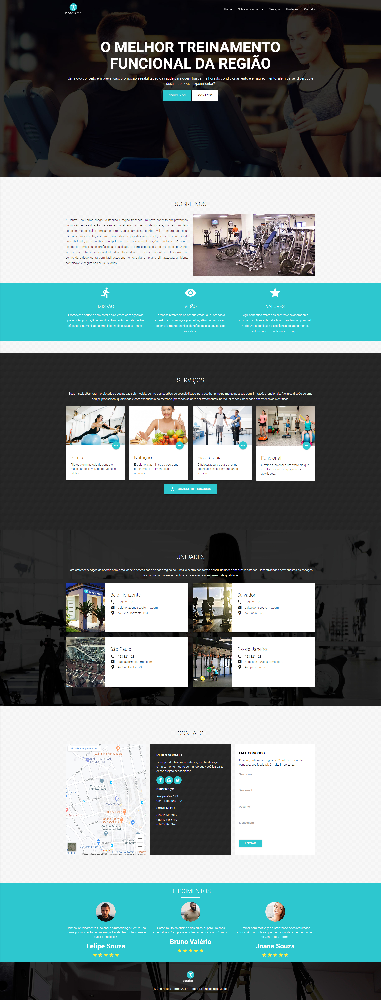

# Projeto Centro Boa Forma

## Projeto prático Centro Boa forma feito em HTML5, animações com css3, Framework Materialize pelo site [NODESTUDIO](https://www.nodestudio.com.br/curso/curso-carreira-web-sites-profissionais).

## Link do Projeto: [Centro Boa Forma](https://marcelo-rafael.github.io/projeto-centro-boa-forma/)

